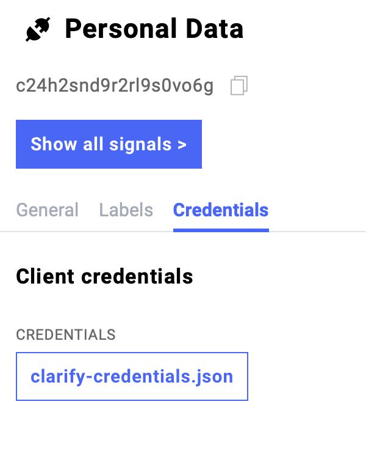

.. _getcredentials:

***********
Credentials
***********

.. currentmodule:: pyclarify

**How to find them**

Once you have loged in into `Clarify <https://www.clarify.us>`__, go to Integrations. 
Click on the integration in which you want to create a signal. 
In the pop up window under 'Credentials' you can download your credentials.

