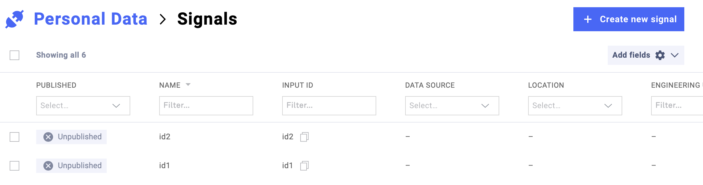
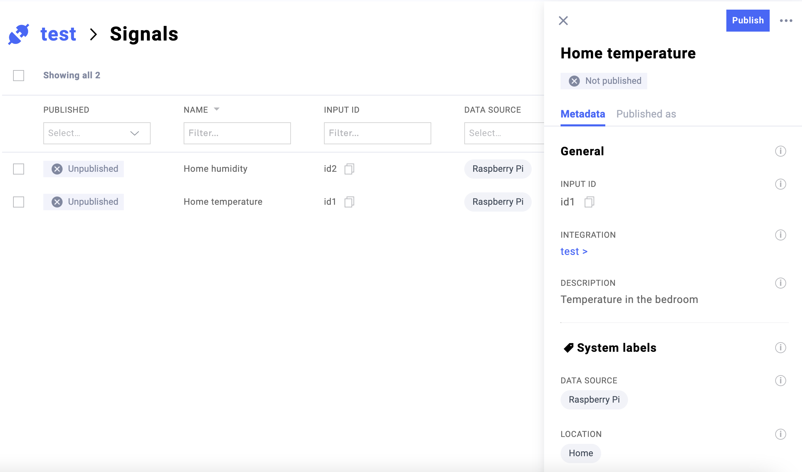

====================
PyClarify quickstart
====================

.. currentmodule:: pyclarify

.. code-block:: python

   >>> import pyclarify

Prerequisites
=============

You'll need to know a bit of Python. For a refresher, see the `Python
tutorial <https://docs.python.org/tutorial/>`__.

You'll need your Clarify credentials. Click :ref:`here <getcredentials>` for how to find them.

Interact with Clarify
=====================
PyClarify provides a fast and easy way to write data into Clarify, create or update the signal metadata and get item data, by using the :py:meth:`~pyclarify.client.APIClient` class. 
This class takes as an argoument the path of your credentials in string format, which always should be the first step when starting to interact with the Clarify API. 

For information about the Clarify Developer documentation
click `here <https://docs.clarify.io/reference>`__.

Write data into Clarify
^^^^^^^^^^^^^^^^^^^^^^^

Step 1: Create a :py:meth:`~pyclarify.models.data.DataFrame` model. 

Step 2: Use the  :py:meth:`~pyclarify.client.APIClient.insert` method which takes as an argoument the DataFrame model.

An example
^^^^^^^^^^

.. code-block:: python

    >>> from pyclarify.client import APIClient
    >>> from pyclarify.models.data import DataFrame

    >>> client = APIClient("./clarify-credentials.json")

    >>> data = DataFrame(
    >>>     times=["2021-03-11T21:50:06Z", "2021-04-11T21:50:06Z"],
    >>>     series={"id1": [1, 2], "id2": [4, 5]},
    >>> )
    >>> response = client.insert(data=data)
    >>> print(response)

After that you should be able to see the newly created signal in Clarify.

|

|

Add signal metadata
===================

To add or update the signal's metadata, use the :py:meth:`~pyclarify.client.APIClient.save_signals` method. 

Step 1 : Create a :py:meth:`~pyclarify.models.data.Signal` model. 

Step 2 : Use the  :py:meth:`~pyclarify.client.APIClient.save_signals` method which takes as a first argoument *inputs* which is a dictionary with keys the signal-id-name and values the signal model. 
The second argoument is *created_only* which when set to False will not ignore all existing signal.

An example
^^^^^^^^^^

.. code-block:: python

    >>> from pyclarify.client import APIClient
    >>> from pyclarify.models.data import Signal

    >>> client = APIClient("./clarify-credentials.json")
    
    >>> signal = Signal(
    >>>    name="id1",
    >>>    description="Clarify is awesome!",
    >>>     labels={"data-source": ["Office"], "location": ["Trondheim"]},
    >>> )
    >>> response = client.save_signals(inputs={"id1": signal}, created_only=False)
    >>> print(response)

|

|

Get Item data  
=============

To get data of an item, you first must have an integration with reading access. 
Once the is a reading access for an integation, use the :py:meth:`~pyclarify.client.APIClient.select_items` method.

Step 1: Create a :py:meth:`~pyclarify.models.requests.ItemSelect` model. This model uses three other models.
The :py:meth:`~pyclarify.models.requests.SelectItemsParams`, :py:meth:`~pyclarify.models.requests.SelectTimesParams` and the :py:meth:`~pyclarify.models.requests.SelectSeriesParams`. 

Step 2: Call the :py:meth:`~pyclarify.client.APIClient.select_items` method with ItemSelect as an argument.

An example
^^^^^^^^^^

.. code-block:: python

    >>> from pyclarify.client import APIClient
    >>> from pyclarify.models.requests import (
    >>>         ItemSelect,
    >>>         SelectItemsParams,
    >>>         SelectTimesParams,
    >>>         SelectSeriesParams,
    >>> )

    >>> client = APIClient("./clarify-credentials.json")

    >>> items = SelectItemsParams(include=True, filter={"id": {"$in": ["id1"]}})
    >>> times = SelectTimesParams(
    >>>         notBefore="2021-03-10T21:50:06Z", before="2021-04-11T22:50:06Z"
    >>> )
    >>> series = SelectSeriesParams(items=True)

    >>> params = ItemSelect(items=items, times=times, series=series)

    >>> response = client.select_items(params=params)
    >>> print(response)

